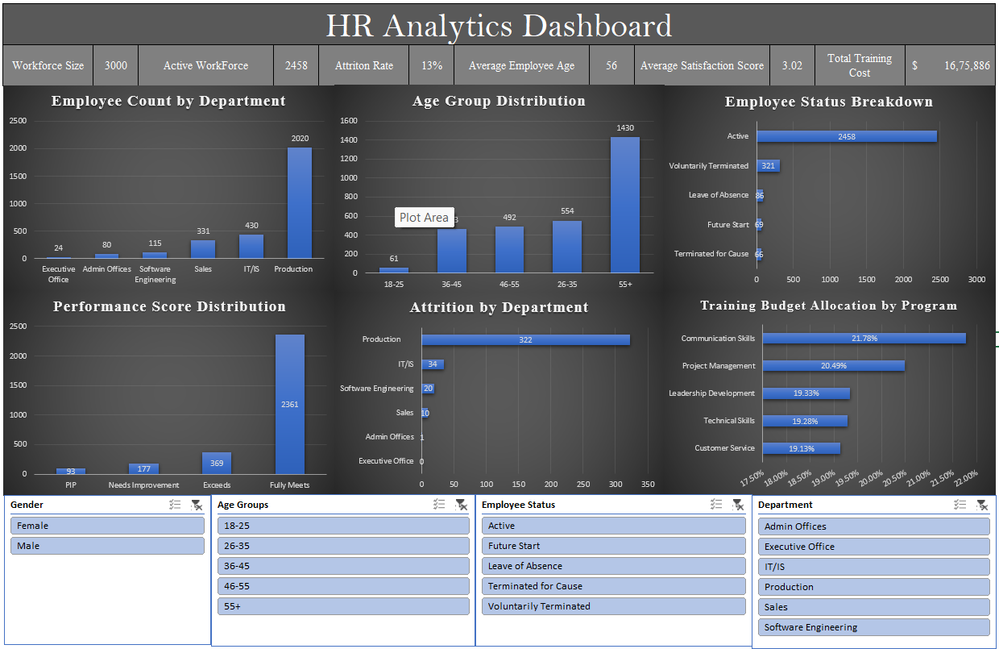

# HR Analytics Dashboard

## Project Overview

This project presents an interactive HR Analytics Dashboard built in Microsoft Excel to analyze workforce demographics, employee performance, attrition trends, employee satisfaction, and training investments. The dashboard transforms raw HR data into actionable insights through KPI tracking, visual analytics, and interactive filtering.

The project was developed using Microsoft Excel with data cleaning, calculated fields, Pivot Tables, Pivot Charts, KPI cards, and slicers to support workforce analysis and decision-making.

---

## Dashboard Preview

---

## Objective

The objective of this project is to analyze employee-related data and answer key HR business questions such as:

* What is the overall workforce composition across departments and age groups?
* Which departments experience the highest employee attrition?
* How are employees performing across the organization?
* What is the distribution of employee statuses?
* How is the training budget allocated across different programs?
* What insights can be derived from employee satisfaction and engagement metrics?

---

## Dataset

The project uses a synthetic HR dataset containing employee demographics, employment status, performance ratings, engagement scores, satisfaction metrics, and training information.

The dataset was cleaned and transformed before creating the dashboard, including:

* Age calculation from Date of Birth
* Age group categorization
* Employee tenure calculation
* Active employee identification
* Attrition flag creation
* KPI metric development

---

## Dashboard Features

### KPI Cards

* Workforce Size
* Active Workforce
* Attrition Rate
* Average Employee Age
* Average Satisfaction Score
* Total Training Cost

### Interactive Filters

* Gender
* Age Group
* Employee Status
* Department

### Visual Analysis

* Employee Count by Department
* Age Group Distribution
* Employee Status Breakdown
* Performance Score Distribution
* Attrition by Department
* Training Budget Allocation by Program

---

## Skills Demonstrated

* Data Cleaning & Transformation
* Excel Formula Development
* KPI Design & Development
* Pivot Tables
* Pivot Charts
* Dashboard Design
* Interactive Reporting with Slicers
* Data Visualization
* HR Data Analysis

---

## Key Insights

* The Production department accounts for the largest share of the workforce.
* Employees aged 55+ represent the largest age group in the dataset.
* The majority of employees fall within the "Fully Meets" performance category.
* Overall employee attrition is approximately 13%.
* Employee attrition is concentrated primarily within the Production department.
* Training investments are distributed across multiple development programs, with Communication Skills receiving the largest share of the training budget.

---

## Tools Used

* Microsoft Excel
* Pivot Tables
* Pivot Charts
* Slicers
* Conditional Formatting

---

## Project Outcome

This dashboard converts raw HR data into an interactive workforce analytics solution that supports employee monitoring, performance evaluation, attrition analysis, and training investment tracking.

The project demonstrates practical Excel-based business intelligence skills, including data cleaning, KPI reporting, dashboard development, interactive reporting, and HR data analysis.
